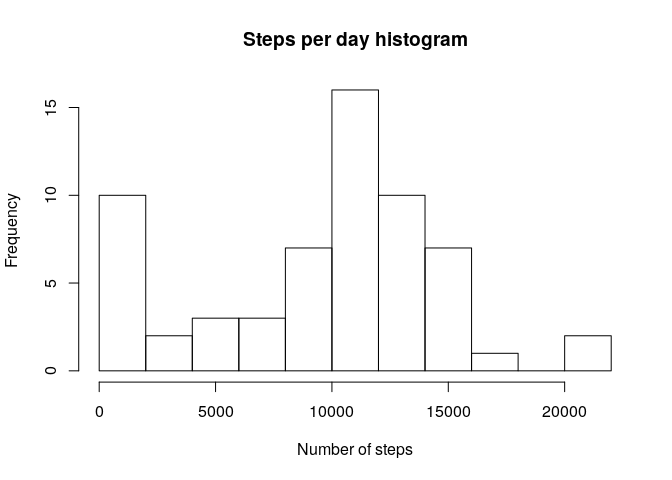
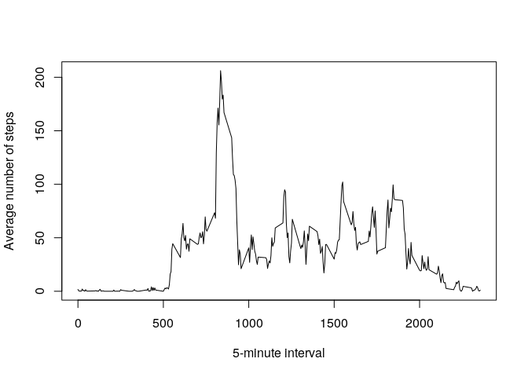
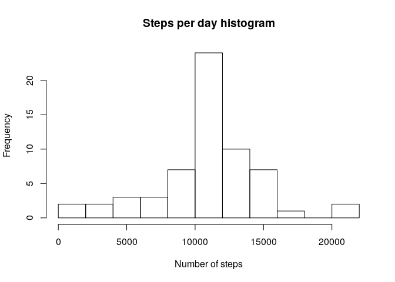
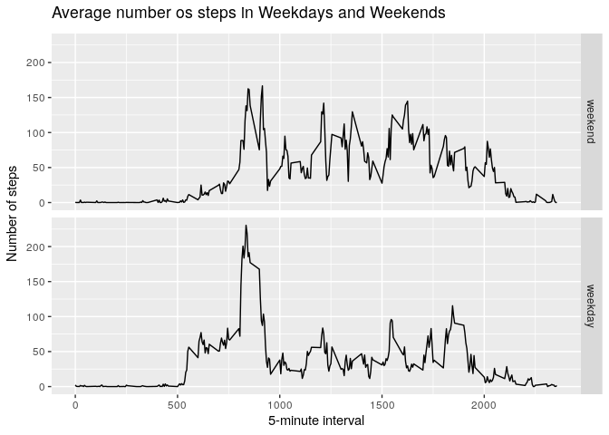

Author: João Vitor Sousa Floriano


## Loading and preprocessing the data

In order to load the data into R, we need to read the steps dataset using the read.csv() function.


```r
stepsDF <- read.csv("activity.csv")
```

After that, it is very useful to transform the date column of the data frame in order to facilitate future studies.


```r
stepsDF$date <- as.Date(as.character(stepsDF$date))
class(stepsDF$date)
```

```
## [1] "Date"
```

```r
head(stepsDF)
```

```
##   steps       date interval
## 1    NA 2012-10-01        0
## 2    NA 2012-10-01        5
## 3    NA 2012-10-01       10
## 4    NA 2012-10-01       15
## 5    NA 2012-10-01       20
## 6    NA 2012-10-01       25
```

## What is mean total number of steps taken per day?

In order to give a response to this question we are first going to calculate the total number of steps taken per day using the aggregate function in order to create another data frame with this result. 


```r
stepsDFAgg <- with(stepsDF, aggregate(steps,list(date),sum,na.rm=TRUE))
```
Besides that we are also going to rename the columns of the new data frame.

```r
names(stepsDFAgg) <- c("Date","Steps.per.day")
```

And finally we can work on out histogram, calculate the mean and the median


```r
hist(stepsDFAgg$Steps.per.day, breaks = 10, main = "Steps per day histogram", xlab = "Number of steps")
```

<!-- -->

```r
mean(stepsDFAgg$Steps.per.day)
```

```
## [1] 9354.23
```

```r
median(stepsDFAgg$Steps.per.day)
```

```
## [1] 10395
```

## What is the average daily activity pattern?

Just as we made in the previous question, we are going to create a new data frame that has the average number of steps per 5-minute interval using the function aggregate.


```r
stepsDFAgg2 <- with(stepsDF, aggregate(steps,list(interval),mean,na.rm=TRUE))
names(stepsDFAgg2) <- c("Time.Interval", "Avg.Steps")
```

After this, we can plot our time series with the code below.


```r
plot(stepsDFAgg2$Time.Interval,
     stepsDFAgg2$Avg.Steps,
     type="l",
     xlab = "5-minute interval",
     ylab = "Average number of steps")
```

<!-- -->


## Imputing missing values

In order to analyse the influence of missing values in out data we must first compute the total amount of NA's in the dataset with the is.na function. Below you can see both the total value and the percentage of missing values in the data.


```r
sum(is.na(stepsDF))
```

```
## [1] 2304
```

```r
sum(is.na(stepsDF))/nrow(stepsDF)
```

```
## [1] 0.1311475
```

After have an idea of the total amount of missing values in our data, we are going to replace the missing values by the average number of steps for the corresponding 5-minute interval.

In order to do this, we first are going to use the stepsDFAgg2 data frame created before and rename its columns as follows:


```r
names(stepsDFAgg2) <- c("interval", "Steps")
```
Right after that, we are going to select the part of the original data frame that has missing values.


```r
stepsNA <- stepsDF[which(is.na(stepsDF$steps)),]
```
Then, we can use the dplyr library and its function left_join to merge the stepsDFAgg2 and the stepsNA data. Besides that, we can also remove the repeated steps column of the resultant data frame with the subset function.

```r
library(dplyr)

stepsLJoin <- left_join(stepsDFAgg2,stepsNA, by =c("interval"= "interval"))

stepsLJoin <- subset(stepsLJoin,select = -c(steps))
```
In the sequence, we can use the left_join one more time in order to merge the stepsLJoin and the original data. Finally, we construct a final tidy Steps column with the replaced data and remove the repeated steps column of the resultant data frame with the subset function.

```r
stepsLJoincsv <- left_join(stepsDF,stepsLJoin, by =c("interval"= "interval", "date"="date"))

stepsLJoincsv$Steps[is.na(stepsLJoincsv$Steps)]<- stepsLJoincsv$steps[!is.na(stepsLJoincsv$steps)]

stepsLJoincsv =  subset(stepsLJoincsv,select = -c(steps))

head(stepsLJoincsv)
```

```
##         date interval     Steps
## 1 2012-10-01        0 1.7169811
## 2 2012-10-01        5 0.3396226
## 3 2012-10-01       10 0.1320755
## 4 2012-10-01       15 0.1509434
## 5 2012-10-01       20 0.0754717
## 6 2012-10-01       25 2.0943396
```

```r
head(stepsDF)
```

```
##   steps       date interval
## 1    NA 2012-10-01        0
## 2    NA 2012-10-01        5
## 3    NA 2012-10-01       10
## 4    NA 2012-10-01       15
## 5    NA 2012-10-01       20
## 6    NA 2012-10-01       25
```

```r
head(stepsDFAgg2)
```

```
##   interval     Steps
## 1        0 1.7169811
## 2        5 0.3396226
## 3       10 0.1320755
## 4       15 0.1509434
## 5       20 0.0754717
## 6       25 2.0943396
```

In the last step of this topic we are going to remake our histogram of the total number of steps taken each day as well as recalculate the mean and the median of the new dataset without missing values.

```r
stepsNoNAAgg <- with(stepsLJoincsv, aggregate(Steps,list(date),sum))
names(stepsNoNAAgg) <- c("Date","Steps.per.day")
hist(stepsNoNAAgg$Steps.per.day, breaks = 10, main = "Steps per day histogram", xlab = "Number of steps")
```

<!-- -->

```r
mean(stepsNoNAAgg$Steps.per.day)
```

```
## [1] 10766.19
```

```r
median(stepsNoNAAgg$Steps.per.day)
```

```
## [1] 10766.19
```
Because of the distribution of the missing values, the mean and the median converged to the sum of the average number of steps per time interval.

```r
stepsNumberNA <- stepsDF %>% group_by(date) %>% summarise(sum(is.na(steps)))
```

```r
head(stepsNumberNA)
```

```
## # A tibble: 6 x 2
##   date       `sum(is.na(steps))`
##   <date>                   <int>
## 1 2012-10-01                 288
## 2 2012-10-02                   0
## 3 2012-10-03                   0
## 4 2012-10-04                   0
## 5 2012-10-05                   0
## 6 2012-10-06                   0
```

```r
tail(stepsNumberNA)
```

```
## # A tibble: 6 x 2
##   date       `sum(is.na(steps))`
##   <date>                   <int>
## 1 2012-11-25                   0
## 2 2012-11-26                   0
## 3 2012-11-27                   0
## 4 2012-11-28                   0
## 5 2012-11-29                   0
## 6 2012-11-30                 288
```

```r
sum(stepsDFAgg2$Steps)
```

```
## [1] 10766.19
```

## Are there differences in activity patterns between weekdays and weekends?

The first task of this part of the assignment is to create a new factor variable in the dataset with two levels – “weekday” and “weekend” indicating whether a given date is a weekday or weekend day. For this, we first want to discover how to obtain the weekdays in English being in a brazilian system.


```r
weekDaysEng <- c("Sunday", "Monday", "Tuesday", "Wednesday", "Thursday","Friday", "Saturday")[as.POSIXlt(stepsLJoincsv$date)$wday+ 1]
```
After this, we can use this object as reference to create our factor column isWeekend.

```r
weekendDaysRef <- c("Sunday","Saturday")
stepsLJoincsv$weekdays <- weekDaysEng
stepsLJoincsv$isWeekend <- factor((weekDaysEng %in% weekendDaysRef),levels=c(TRUE, FALSE), labels=c('weekend', 'weekday'))

stepsLJoincsv %>% slice_sample(n=12)
```

```
##          date interval     Steps  weekdays isWeekend
## 1  2012-10-21     2350  0.000000    Sunday   weekend
## 2  2012-11-21      550  0.000000 Wednesday   weekday
## 3  2012-11-20      250  0.000000   Tuesday   weekday
## 4  2012-11-16     2325  0.000000    Friday   weekday
## 5  2012-11-30     1030 44.283019    Friday   weekday
## 6  2012-10-31     2125  0.000000 Wednesday   weekday
## 7  2012-10-19     1100  0.000000    Friday   weekday
## 8  2012-11-19      420  0.000000    Monday   weekday
## 9  2012-11-08     2005 30.000000  Thursday   weekday
## 10 2012-10-08      535  6.056604    Monday   weekday
## 11 2012-10-09      735 10.000000   Tuesday   weekday
## 12 2012-11-07       40  0.000000 Wednesday   weekday
```
In the sequence, we are going to make a panel time series plot of the 5-minute interval (x-axis) and the average number of steps taken, averaged across all weekday days or weekend days (y-axis). 

In order to accomplish this task we are going to create a new data frame that has the average number of steps per 5-minute interval using the function aggregate (one for each one of the subsets)


```r
stepsAvgInterval <- with(stepsLJoincsv, aggregate(Steps,list(interval,isWeekend),mean,na.rm=TRUE))
names(stepsAvgInterval) <- c("Time.Interval", "isWeekend", "Avg.Steps")
```
With both of the data frames generated we can configure our panel plot using ggplot.

```r
library(ggplot2)
g<- ggplot(stepsAvgInterval, aes(Time.Interval,Avg.Steps)) + 
  facet_grid(isWeekend~.)+
  geom_line() +
  labs(title=expression("Average number os steps in Weekdays and Weekends")) +
  labs(y=expression("Number of steps")) +
  labs(x=expression("5-minute interval"))
print(g)
```

<!-- -->
